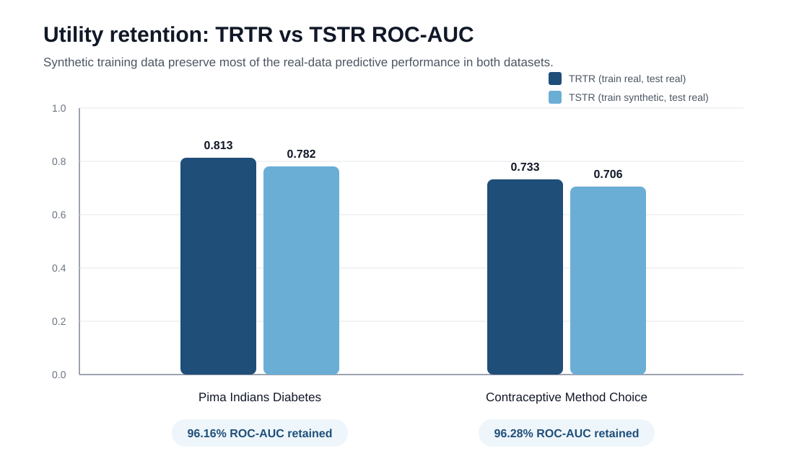
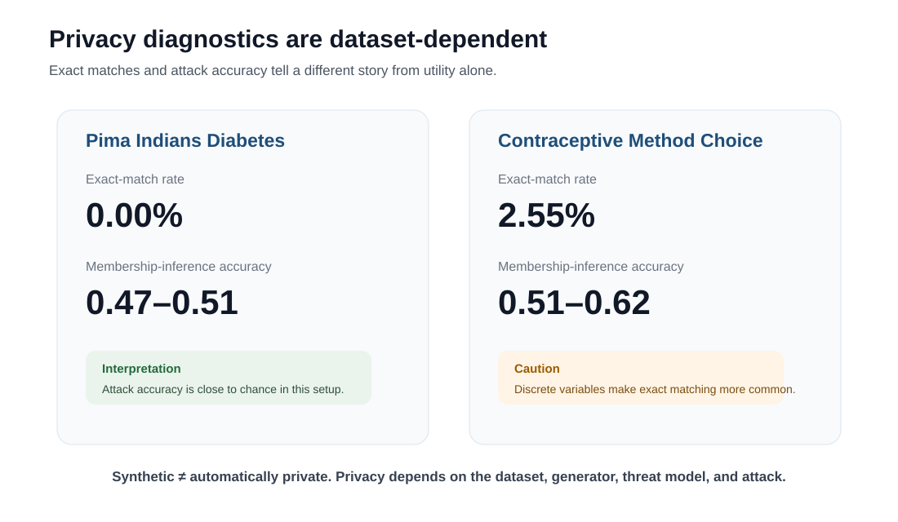
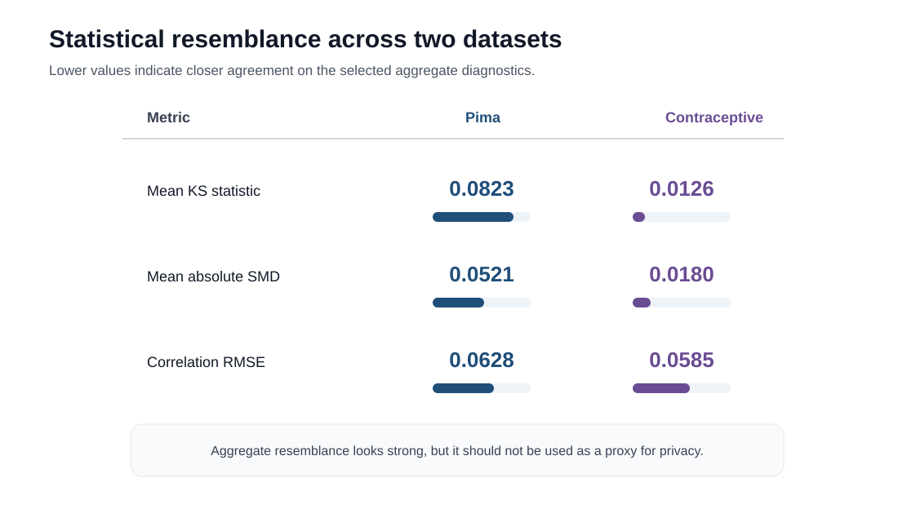

# Synthetic Tabular Data Privacy Evaluation

Reproduction and evaluation of synthetic tabular data methods, with current experiments focusing on **resemblance, utility, and privacy**; **fairness is a planned extension**.

This repository is being developed as a reproducible research exercise in privacy-enhancing technologies (PETs) and generative AI. It is based on the evaluation framework and public code released by Hernandez et al. for synthetic tabular data in the health domain.

## Assignment deliverables — current completion

- [x] **One synthetic-data method implemented:** Gaussian Multivariate
- [x] **Two datasets reproduced:** Pima Indians Diabetes + Contraceptive Method Choice
- [x] **README and reproducible repository structure**
- [x] **Environment specification and automated data download**
- [x] **Resemblance evaluation**
- [x] **TRTR vs. TSTR utility evaluation**
- [x] **Privacy screening**
- [x] **Upstream-style membership-inference simulation**
- [x] **Successful clean-environment GitHub Actions run**
- [ ] **Fairness analysis** — planned extension, not yet claimed as completed

This satisfies the coding portion of the onboarding task while keeping the current privacy claims deliberately conservative.

## Current status

**Stage 2 — two-dataset Gaussian baseline + upstream-style membership-inference simulation**

The current pipeline runs on two published datasets from the upstream repository:

- **Dataset E:** Pima Indians Diabetes
- **Dataset D:** Contraceptive Method Choice

For both datasets, the repository:

- generates a synthetic training set with a Gaussian multivariate model;
- evaluates statistical resemblance;
- compares Train-on-Real/Test-on-Real (TRTR) with Train-on-Synthetic/Test-on-Real (TSTR);
- performs nearest-neighbour and exact-match privacy screening;
- performs a deterministic adaptation of the upstream Hamming-distance membership-inference simulation;
- runs automatically in GitHub Actions.

The privacy analyses are **empirical diagnostics, not formal privacy guarantees**.

## Research questions

1. How closely does synthetic tabular data resemble the source data?
2. How much downstream predictive utility is retained?
3. Do synthetic records show signs of excessive proximity to real training records?
4. Can an attacker distinguish training members from held-out non-members under an upstream-style membership-inference simulation?
5. **Future extension:** how should fairness be evaluated jointly with privacy, utility, and resemblance?

## Source study

This project is informed by:

> Hernandez, M., Epelde, G., Alberdi, A., Cilla, R., & Rankin, D.  
> *Synthetic Tabular Data Evaluation in the Health Domain Covering Resemblance, Utility, and Privacy Dimensions.*

Official upstream repository:  
https://github.com/Vicomtech/STDG-evaluation-metrics

The source repository evaluates synthetic tabular data across **resemblance, utility, and privacy**, using six open-source datasets and four generation approaches: Gaussian Multivariate, SDV, CTGAN, and WGAN-GP.

## Repository structure

~~~text
.
├── README.md
├── requirements.txt
├── environment.yml
├── data/
│   └── README.md
├── docs/
│   ├── methods.md
│   ├── research_notes.md
│   └── ci.md
├── notebooks/
│   └── README.md
├── results/
│   ├── README.md
│   ├── BASELINE_RESULTS.md
│   └── TWO_DATASET_RESULTS.md
└── src/
    ├── __init__.py
    ├── config.py
    ├── download_data.py
    ├── generate.py
    ├── evaluate.py
    ├── privacy_attacks.py
    └── run_baseline.py
~~~

Downloaded data and generated synthetic records are excluded from version control and can be regenerated.

## Quick start

### 1. Create an environment

With Conda:

~~~bash
conda env create -f environment.yml
conda activate std-privacy-eval
~~~

or with pip:

~~~bash
python -m venv .venv
# Windows:
.venv\Scripts\activate
# macOS/Linux:
source .venv/bin/activate

pip install -r requirements.txt
~~~

### 2. Download the published train/test splits

~~~bash
python -m src.download_data
~~~

### 3. Run the full two-dataset baseline

~~~bash
python -m src.run_baseline
~~~

The pipeline automatically generates synthetic data and writes the detailed result summaries under `results/tables/`.

## Results at a glance

### Utility

### Privacy diagnostics

### Statistical resemblance

## Validated results

The latest two-dataset run completed successfully in GitHub Actions.

| Dataset | TRTR ROC-AUC | TSTR ROC-AUC | ROC-AUC retention | Exact-match rate |
|---|---:|---:|---:|---:|
| Pima Indians Diabetes | 0.8134 | 0.7822 | 96.16% | 0.00% |
| Contraceptive Method Choice | 0.7330 | 0.7058 | 96.28% | 2.55% |

### Resemblance

| Dataset | Mean KS | Mean absolute SMD | Correlation RMSE |
|---|---:|---:|---:|
| Pima | 0.0823 | 0.0521 | 0.0628 |
| Contraceptive | 0.0126 | 0.0180 | 0.0585 |

Both datasets retain substantial predictive utility under this baseline, with TSTR ROC-AUC close to the corresponding TRTR reference.

The **2.55% exact-match rate on the Contraceptive dataset is a caution signal**, not automatically evidence of disclosure. This dataset is highly discrete and contains repeated combinations, so exact matches can occur more readily than in a continuous-valued dataset. It nevertheless motivates stronger disclosure-risk testing.

### Upstream-style membership-inference simulation

The source repository evaluates membership inference by quantile-coding records and using Hamming-distance thresholds. This repository implements a deterministic adaptation of that procedure with thresholds 0.4, 0.3, 0.2, and 0.1.

For Pima, mean attack accuracy across attacker-data proportions ranges from approximately **0.47 to 0.51**. For the Contraceptive dataset it ranges from approximately **0.51 to 0.62**, with the strictest threshold producing the strongest apparent separation.

These values should **not** be interpreted as a proof of privacy or as a direct comparison with differential privacy. They are attack-specific empirical diagnostics.

Detailed results are documented in:

- `results/TWO_DATASET_RESULTS.md`
- `results/audited/`

## Interpretation

The current results support three preliminary observations:

- a simple Gaussian multivariate generator can retain a large proportion of downstream utility on both datasets;
- high aggregate resemblance does not automatically imply low disclosure risk;
- privacy conclusions are sensitive to the threat model and evaluation method.

The project therefore treats **resemblance, utility, and privacy as distinct dimensions** rather than assuming that good performance on one implies good performance on the others.

## Next extensions

- add a second generator such as SDV or CTGAN;
- reproduce the upstream similarity and attribute-inference analyses;
- strengthen membership-inference evaluation;
- add differential-privacy mechanisms and explicit privacy budgets;
- add fairness and subgroup-utility metrics;
- produce presentation-ready figures and notebooks.

## Reproducibility principles

- fixed random seeds where supported;
- explicit data provenance;
- no private sensitive data committed to GitHub;
- generated outputs separated from source code;
- clear distinction between replication, adaptation, and extension;
- conservative interpretation of privacy evidence.

## Author

**Menglin Li**  
City University of Macau

## Acknowledgement

This repository is an independent reproduction and learning project. It does not claim authorship of the original evaluation framework or datasets. Please cite the original study and upstream repository when reusing their materials or ideas.
